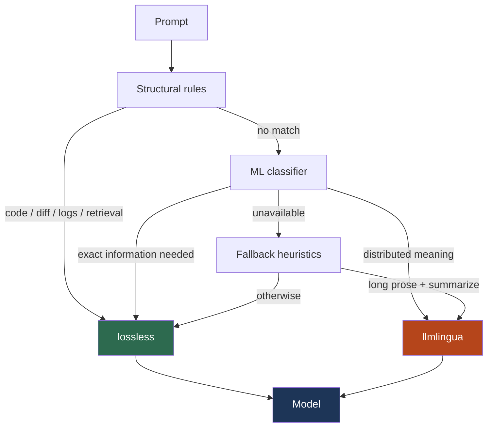

# Shiori

[](https://github.com/PaoloMassignan/shiori/actions/workflows/ci.yml)

**Optimize quality first. Compress when safe.**

Shiori sits between your application and any OpenAI-compatible API. It detects the task type, selects the strategy that historically preserved the most quality for that task, and compresses only when it is safe to do so.

```
your app → Shiori → OpenAI (or any provider)
```

Drop-in replacement. No client changes needed.

---

## The quality-first approach

Most prompt compression systems ask: **"How much can we compress?"**

Shiori asks: **"What is the safest strategy for this task?"**

```
Compression-first                   Shiori
─────────────────────               ──────────────────────────────────
Prompt                              Prompt
  ↓                                   ↓
Compress                            Detect task type
  ↓                                   ↓
Model                               Select quality-safe strategy
                                      ↓
Goal: maximize token savings        Compress (only when safe)
                                      ↓
                                    Model

                                    Goal: maximize expected task quality
                                          while reducing tokens when safe
```

The benchmark results show why this matters. On ZeroSCROLLS quality (multiple-choice), maximum compression destroys quality: **−0.350 delta**. On MeetingBank (meeting transcripts), the same compressor is the right call: **−0.005 delta with 51.7% saving**. The correct answer depends on the task type, not the prompt length.

**Shiori does not route to the compressor with the highest compression ratio. It routes to the compressor that historically preserved the most quality for the detected task type.**

---

## Compression strategies

| Strategy | Type | What it does |
|---|---|---|
| `none` | — | Pass-through. No compression. |
| `caveman` | Lossless | Removes articles (`a`, `an`, `the`) and filler connectives (`furthermore`, `additionally`, …) from the context section. Leaves the question and instructions untouched. |
| `dictionary` | Lossless | Finds phrases that repeat ≥2 times and replaces them with short symbols (`§A`, `§B`, …). The symbol table is injected into the system prompt so the model reconstructs the original. |
| `template` | Lossless | Groups lines that share the same token structure. Extracts the fixed positions into a template (`[T] fixed <*> fixed`) and stores only the variable values as pipe-separated rows. Works on logs, records, tables, repeated API output — any structured line-based text. |
| `lossless` | Lossless | Pipeline: **template → caveman → dictionary**. On narrative text, template is a no-op and the pipeline reduces to caveman + dictionary. On structured text, template extracts the repeated structure first, then caveman and dictionary compress what remains. |
| `llmlingua` | **Lossy** | Token-level compression via [LLMLingua-2](https://huggingface.co/microsoft/llmlingua-2-bert-base-multilingual-cased-meetingbank). A BERT classifier scores each token and drops low-importance ones. Achieves 40–55% compression. Information is permanently dropped — no symbol table is produced. |

**Safe default**: `lossless`. It never removes information and never expands the prompt. If the compressed result is larger than the original, it returns the original unchanged.

---

## Benchmark results

This table comes from [LZPrompt](https://github.com/paolomassignan/LZPrompt), the benchmark platform behind Shiori's routing decisions.

| Benchmark | Task type | Best strategy | Token saving | Quality delta | Notes |
|---|---|---|---|---|---|
| **HotPotQA** † | Multi-hop QA | `lossless` | 8.7% | **+0.050** | Removing articles reduces distractor noise |
| EnterpriseRAG | Entity QA (Slack/Linear/Confluence) | `lossless` | 2.8% | **+0.001** | LLMLingua drops entity values → −0.086 |
| MeetingBank | Meeting transcript summarization | `llmlingua` | **51.7%** | −0.005 | LLMLingua-2 was trained on meeting notes |
| **ZeroSCROLLS gov_report** † | Document summarization | `llmlingua` | **52.7%** | −0.009 | Long prose, key facts distributed |
| **ZeroSCROLLS quality** † | Multiple-choice (MCQ) | `lossless` | 9.0% | **0.000** | LLMLingua drops choice-distinguishing tokens → −0.350 |
| **ZeroSCROLLS musique** † | Multi-hop QA | `lossless` | 8.1% | −0.004 | — |
| SWE-bench | Patch generation | `lossless` | 5.6% | **+0.067** | LLMLingua removes file paths → −0.267 |
| LogBench | Log template extraction | `lossless` (template) | **30.4%** | −0.027 | Template compressor: 4× more saving than caveman alone |
| RULER MK-NIAH | Multi-key retrieval | `lossless` | **73.4%** | **0.000** | Synthetic filler repeats → dictionary near-perfect |
| RULER VT | Variable chain tracking | `lossless` | **73.7%** | **0.000** | Dropping one chain link destroys the answer |
| **InfiniteBench passkey** † | Passkey retrieval (125K ctx) | `lossless` | **91.0%** | **0.000** | 12 rotating filler paragraphs → dictionary eliminates them |
| **InfiniteBench kv_retrieval** † | UUID key-value lookup | `lossless` | 0.0% | **0.000** | All values unique — nothing to compress, correctly passed through |
| LongBench | QA + summarization (mixed) | `llmlingua` | **51.3%** | −0.012 | — |
| NIAH | Needle-in-a-haystack (synthetic) | `lossless` | **71.9%** | **0.000** | — |
| 2WikiMultihopQA | Multi-hop QA | `lossless` | 6.3% | −0.020 | — |

† Used to train the ML classifier — results on these benchmarks may overestimate generalization.

**Key insight**: the task type matters more than the prompt length. A 500-token QA prompt and a 5000-token QA prompt both need `lossless`. A 5000-token summarization prompt benefits from `llmlingua`.

### Token saving by benchmark

```
InfB passkey †  ████████████████████████████████████  91%
RULER-VT        █████████████████████████████         74%
RULER-NIAH      █████████████████████████████         73%
NIAH            ████████████████████████████          72%
ZS-gov †        █████████████████████                 53%
MeetingBank     ████████████████████                  52%
LongBench       ████████████████████                  51%
LogBench        ████████████                          30%
ZS-quality †    ████                                   9%
HotPotQA †      ███                                    9%
ZS-musique †    ███                                    8%
2WikiMH         ██                                     6%
SWE-bench       ██                                     6%
EntRAG          █                                      3%
InfB-kv †       ·                                      0%
```

### Quality delta vs. no compression

Green = Shiori improves quality. Red = Shiori reduces quality. Gray = no change.

```diff
+SWE-bench       ████████████████████  +0.067
+HotPotQA †      ███████████████       +0.050
+EntRAG          █                     +0.001
 ZS-quality †                           0.000
 RULER-NIAH                             0.000
 RULER-VT                               0.000
 InfB-passkey †                         0.000
 InfB-kv †                              0.000
 NIAH                                   0.000
-ZS-musique †    █                     −0.004
-MeetingBank     ██                    −0.005
-ZS-gov †        ███                   −0.009
-LongBench       ████                  −0.012
-2WikiMH         ███████               −0.020
-LogBench        ██████████            −0.027
```

† ML classifier training data — in-distribution for the classifier.

---

## Quality First

Token savings are useful. Quality degradation is expensive. A 50% compression ratio is not impressive if it destroys the answer. A 6% compression ratio that preserves critical information and improves quality by +0.067 (SWE-bench) is extremely valuable.

### Quality vs. saving — where Shiori lands

Each point is one benchmark. Shiori picks the strategy that historically placed each task as high and as far right as possible.

```
Quality
 delta    + = lossless   * = llmlingua
          │
  +0.07   │   + ←SWE-bench
  +0.05   │     + ←HotPotQA
          │
   0.00   ┼─+─+─+─+───────────────**─────────+──+─────────+────
          │                       ↑           ↑  ↑         ↑
  -0.01   │               MeetBank,ZS-gov  NIAH RULER  InfB-pass
  -0.01   │               LongBench
  -0.02   │  + ←2WikiMH
  -0.03   │           + ←LogBench
          │
          └────┬───────────────────────────┬──────────────────┬──
               0%                         50%               100%
                               Token Saving →
```

The upper-right quadrant is the goal: high token saving with neutral or positive quality. Lossless benchmarks in the far right (RULER, NIAH, InfiniteBench passkey) land there: 70–91% saving at zero quality cost, because the filler text is purely repetitive and lossless compression eliminates it perfectly. LLMLingua benchmarks cluster in the middle-right: high saving with a small, acceptable quality cost on tasks where meaning is distributed (summarization).

The bottom-left is where the wrong strategy lands. Applying LLMLingua to SWE-bench drops quality by **−0.267** because it removes file paths. Applying it to ZeroSCROLLS quality drops quality by **−0.350** because it removes the distinguishing tokens of the correct answer.

### What the wrong strategy costs

These are measured results for cases where both strategies were evaluated on the same benchmark:

| Benchmark | Task | Correct strategy | Quality delta | Wrong strategy | Quality delta |
|---|---|---|---|---|---|
| SWE-bench | Patch generation | `lossless` | **+0.067** | `llmlingua` | −0.267 |
| EnterpriseRAG | Entity QA | `lossless` | **+0.001** | `llmlingua` | −0.086 |
| ZeroSCROLLS quality | MCQ | `lossless` | **0.000** | `llmlingua` | −0.350 |

The cost of the wrong strategy is not a few percentage points — it is a collapse. Routing matters.

---

## How quality is measured

Every benchmark ships with **gold answers** written by human annotators before any model runs. Evaluation is fully automated: the model's output is compared to the gold answer using a fixed formula. No human judgment is involved during the benchmark run.

**Quality delta** is:

```
delta = avg_score(Shiori-compressed prompts) − avg_score(original prompts)
```

Both runs use the same model, `temperature=0`, and the same gold answers. A positive delta means the model answered correctly more often with Shiori than without — compression changed the input token distribution, which changed the model's attention, and the net effect across the full eval set was favorable.

Each benchmark uses the standard metric for its task type:

| Task type | Benchmarks | Metric | What it measures |
|---|---|---|---|
| Multi-hop QA | HotPotQA, ZeroSCROLLS musique, 2WikiMultihopQA | Token F1 | Token-level overlap between predicted and reference answer |
| Entity QA | EnterpriseRAG | Token F1 | Entity values extracted correctly |
| Multiple-choice | ZeroSCROLLS quality | Exact match | Correct answer letter (A/B/C/D) |
| Summarization | MeetingBank, ZeroSCROLLS gov_report, LongBench | ROUGE-L | Longest common subsequence overlap with reference summary |
| Code / patch | SWE-bench | Resolution rate | Fraction of GitHub issues resolved (binary per instance, averaged) |
| Log extraction | LogBench | Template accuracy | Exact match on extracted log template |
| Retrieval | RULER MK-NIAH, RULER VT, InfiniteBench passkey/kv, NIAH | Exact match | Exact retrieval of the target value |

---

## Routing

Shiori routes to the strategy that maximizes expected task quality, not the one with the highest compression ratio. Routing happens in three layers:

**1. Structural rules** — fast, authoritative, always consulted first.

| Signal | Detection | Route | Why |
|---|---|---|---|
| Git diff | `--- a/`, `+++ b/`, `@@` markers | `lossless` | File paths must survive intact |
| Log lines | timestamp + log-level pattern | `lossless` | Template compressor handles these best |
| Stack trace | `Traceback`, `at com.`, `File "…" line` | `lossless` | Line references must not be dropped |
| Code fence | paired ` ``` ` blocks | `lossless` | Token order in code is load-bearing |
| Retrieval query | "needle", "pass key", "secret code", "follow the chain", … | `lossless` | Exact values must survive |

**2. ML classifier** — MiniLM binary classifier (lossless/lossy), <10ms on CPU, runs locally.

Input: `[QUESTION]` + `[ANSWER_FORMAT]` only — the task signal, not the full context. Output: `lossless` or `lossy`.

**3. Fallback heuristics** — when no structural signal is present and the model is unavailable.

- Long prose + summarization instruction → `llmlingua`
- Long prose > 4000 tokens → `llmlingua`
- Otherwise → `lossless`

**Proxy modes:**

| Mode | Behavior |
|---|---|
| `safe` (default) | Lossless only. ML and fallback are capped to `lossless`. |
| `aggressive` | Full routing: lossless or llmlingua based on detected task. |
| `off` | Pass-through. No compression. |
| `debug` | Aggressive + routing decision included in response JSON under `"shiori"`. |

### Task decision map



**Exact information** — tasks where every token matters: code, retrieval, MCQ, entity QA, logs, multi-hop QA.

**Distributed meaning** — tasks where meaning is spread across the text and no single token is critical: meeting summaries, document summaries, long mixed-topic corpora.

---

## ML classifier — training data and held-out benchmarks

The MiniLM classifier is a fine-tuned `all-MiniLM-L6-v2` (22M parameters). It was trained on **940 examples** labeled as `lossless` or `lossy` based on whether the task requires exact token preservation.

### Training data (contaminated — in-distribution for the classifier)

| Dataset | Label | Why |
|---|---|---|
| ZeroSCROLLS `musique` | lossless | Multi-hop QA — exact answer required |
| ZeroSCROLLS `quality` | lossless | MCQ — exact letter retrieval |
| ZeroSCROLLS `gov_report` | lossy | Summarization — distributed meaning |
| InfiniteBench `passkey` | lossless | Retrieval — exact number required |
| InfiniteBench `kv_retrieval` | lossless | Retrieval — exact UUID required |
| HotpotQA | lossless | Multi-hop QA — exact answer required |
| RACE | lossless | MCQ — exact letter retrieval |
| CNN/DailyMail | lossy | Summarization — distributed meaning |

Results on these benchmarks **overestimate** generalization because the classifier was trained on them.

### Held-out benchmarks (new for Shiori — never seen during training)

| Benchmark | Routing (structural or fallback) | Correctly routed? |
|---|---|---|
| MeetingBank | ML → lossy | ✓ |
| EnterpriseRAG | ML → lossless | ✓ |
| SWE-bench | Structural rule (code fence / diff) | ✓ |
| LogBench | Structural rule (log lines) | ✓ |
| RULER | Structural rule (passphrase pattern, after fix) | ✓ |
| NIAH | Structural rule (passphrase pattern) | ✓ |
| LongBench | Fallback (long prose) | ✓ |
| 2WikiMultihopQA | ML → lossless | ✓ |

The structural rules (layer 1) never saw any training data — they are pattern-matching heuristics.

---

## Quick start

```bash
pip install -e "."

# Optional: llmlingua support (aggressive mode)
pip install -e ".[llmlingua]"

# Configure
cp .env.example .env
# Set OPENAI_API_KEY in .env

# Start
shiori
```

Point your client at `http://localhost:8000` instead of `https://api.openai.com`:

```python
from openai import OpenAI

client = OpenAI(base_url="http://localhost:8000/v1", api_key="ignored")
response = client.chat.completions.create(
    model="gpt-4o-mini",
    messages=[{"role": "user", "content": "..."}],
)
```

```bash
# Health and metrics
curl http://localhost:8000/health
curl http://localhost:8000/metrics
```

---

## Modes

```bash
# Safe mode (default) — lossless only
SHIORI_MODE=safe shiori

# Aggressive mode — full routing
SHIORI_MODE=aggressive shiori

# Debug — routing decision in response JSON
SHIORI_MODE=debug shiori
```

---

## Install all extras

```bash
pip install -e ".[dev]"        # test suite
pip install -e ".[llmlingua]"  # LLMLingua-2 (~700MB model)
pip install -e ".[ml]"         # train / retrain the ML router
```

---

## Latency

Shiori adds overhead on top of the provider API call. The provider call itself (100–1000 ms depending on model and prompt length) always dominates.

| Component | Typical overhead | When it runs |
|---|---|---|
| Structural rules | < 1 ms | Every request — regex only |
| ML classifier | 5–10 ms | `aggressive` / `debug` mode, no structural match |
| Lossless compression | 2–10 ms | When strategy = `lossless` |
| LLMLingua compression | 200–500 ms (CPU) · 20–50 ms (GPU) | When strategy = `llmlingua` |

**Safe mode** (default): structural rules + lossless only. Total Shiori overhead is typically **< 10 ms**.

**Aggressive mode**: adds ML classifier when no structural signal is present (~5–10 ms extra). LLMLingua routing adds 200–500 ms on CPU — relevant on long summarization prompts.

The actual `compression_latency_ms` per request is included in the telemetry (`GET /metrics`) and in the response JSON in `debug` mode.

---

## Tests

No API key required. Provider calls are mocked.

```bash
pytest
```

Tests run on Ubuntu, Windows, and macOS across Python 3.10–3.12 via GitHub Actions.

---

## Relationship with LZPrompt

[LZPrompt](https://github.com/paolomassignan/LZPrompt) is the research platform. It runs controlled benchmarks comparing compression techniques across many task types.

Shiori applies what LZPrompt discovers.

Every routing decision in Shiori — which tasks get `lossless`, which get `llmlingua` — is backed by a committed, reproducible LZPrompt benchmark result.
